# EventHub — Event Booking App

> A modern, feature-rich Flutter application for discovering, booking, and managing events — built from a pixel-perfect Figma design.

---

## Table of Contents

- [Overview](#overview)
- [Screenshots](#screenshots)
- [Features](#features)
- [Tech Stack](#tech-stack)
- [Project Structure](#project-structure)
- [Getting Started](#getting-started)
- [Team](#team)

---

## Overview

**EventHub** is a cross-platform mobile application built with Flutter that allows users to explore upcoming events nearby, filter by category, date, location, and price range, manage their profile, invite friends, and share events. The UI is crafted following a clean, modern Figma design system using a custom **AirbnbCereal** typeface and a purple-based color palette.

---

## Screenshots

### Onboarding & Auth

|              Splash               |                 Onboarding 1                 |                 Onboarding 2                 |                 Onboarding 3                 |
| :-------------------------------: | :------------------------------------------: | :------------------------------------------: | :------------------------------------------: |
| 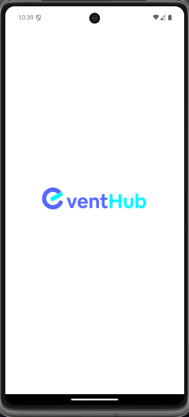 | 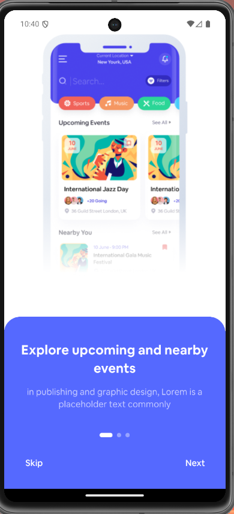 | 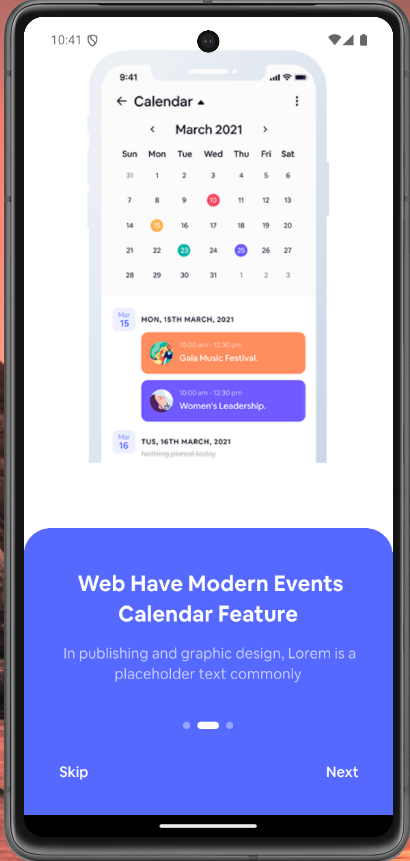 | 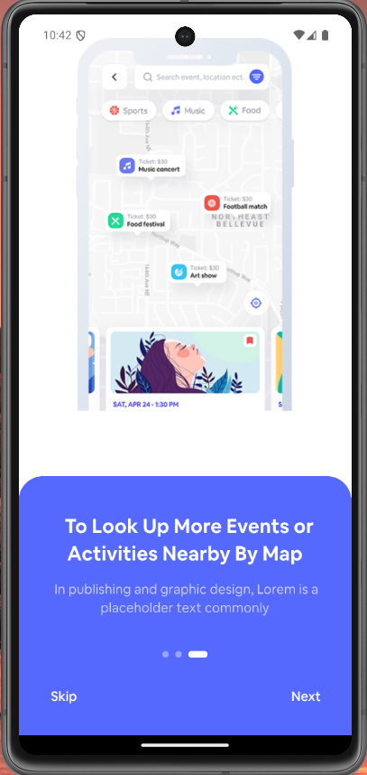 |

|              Sign In               |              Sign Up               |                 Verification                  |                  Reset Password                   |
| :--------------------------------: | :--------------------------------: | :-------------------------------------------: | :-----------------------------------------------: |
| 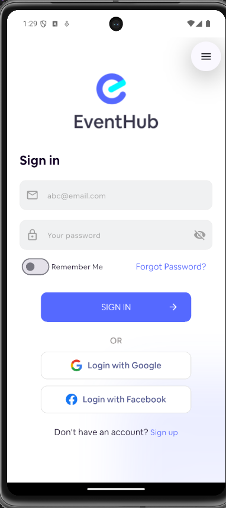 | 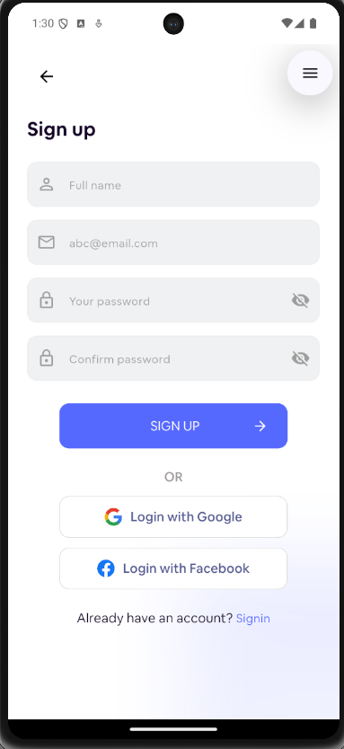 | 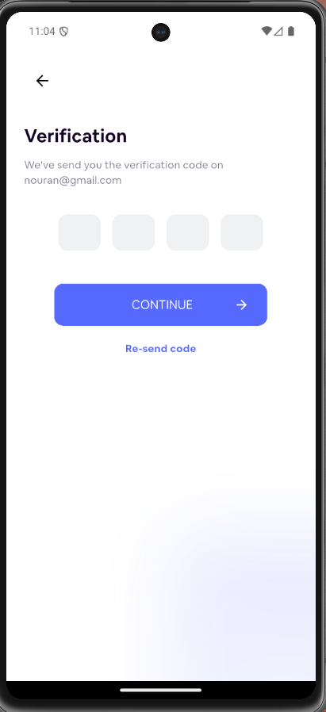 | 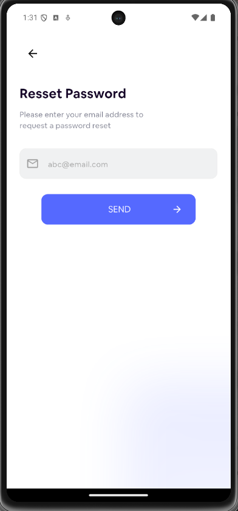 |

### Event Discovery

|             Home              |                  Event Details                  |               Map View                |                  See All Events                   |
| :---------------------------: | :---------------------------------------------: | :-----------------------------------: | :-----------------------------------------------: |
| 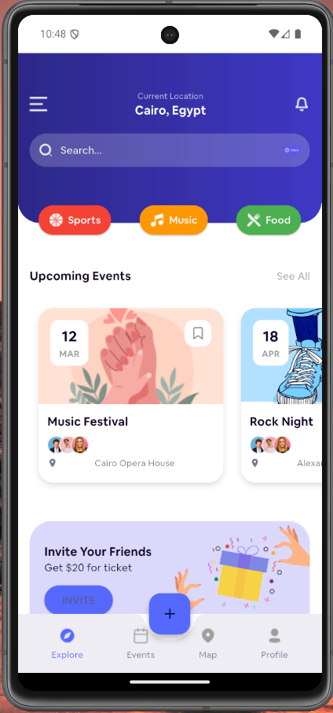 |  | 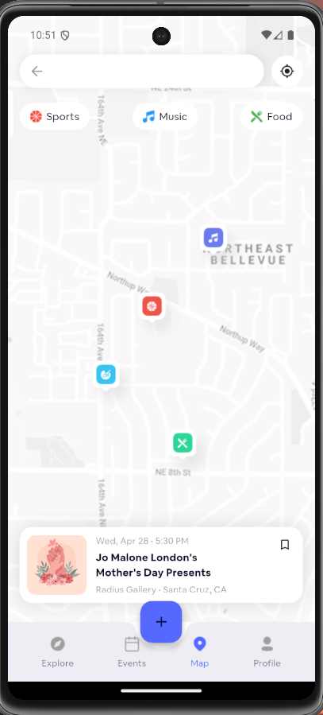 | 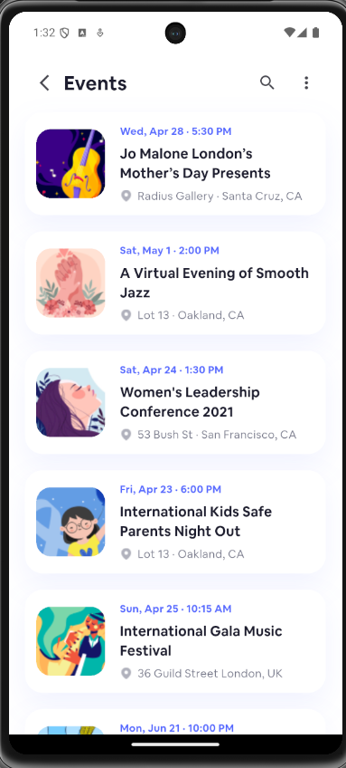 |

|              Search               |              Filter               |                 Empty Events                  |             Menu              |
| :-------------------------------: | :-------------------------------: | :-------------------------------------------: | :---------------------------: |
| 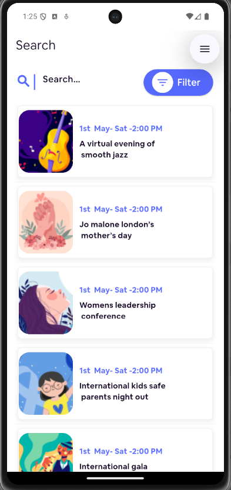 | 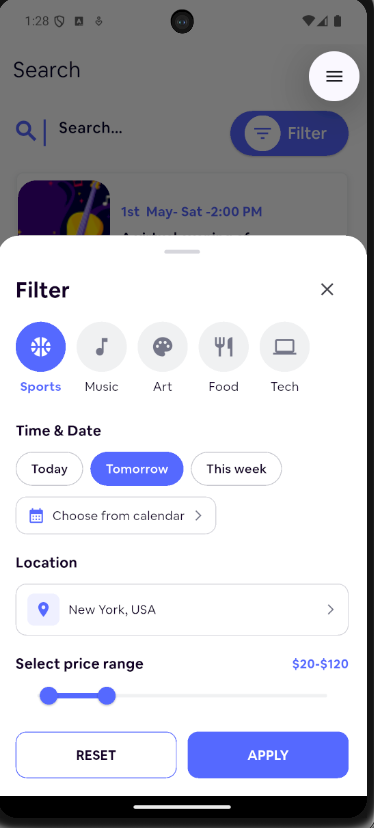 | 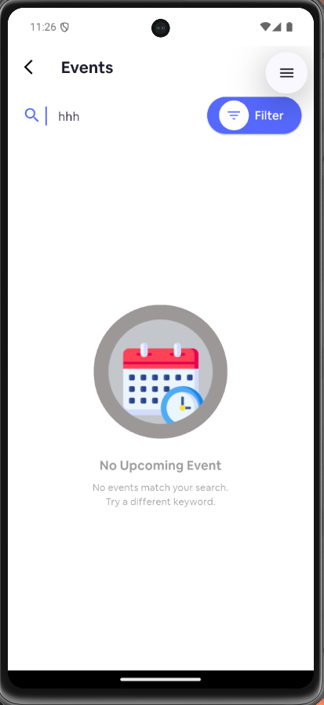 | 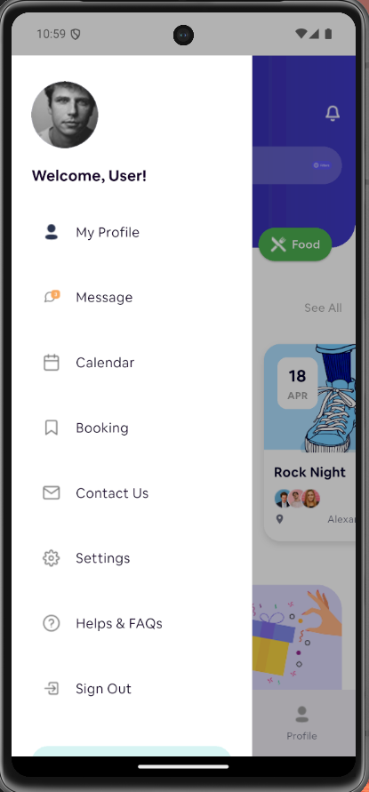 |

### Profile & Social

|               My Profile               |                    Organizer Profile                    |
| :------------------------------------: | :-----------------------------------------------------: |
| 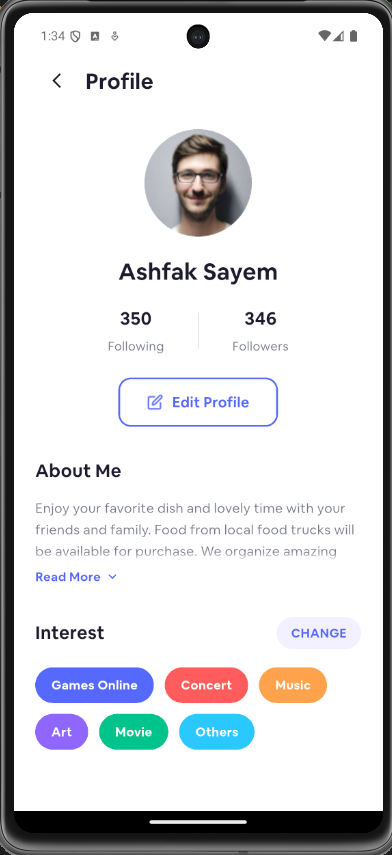 | 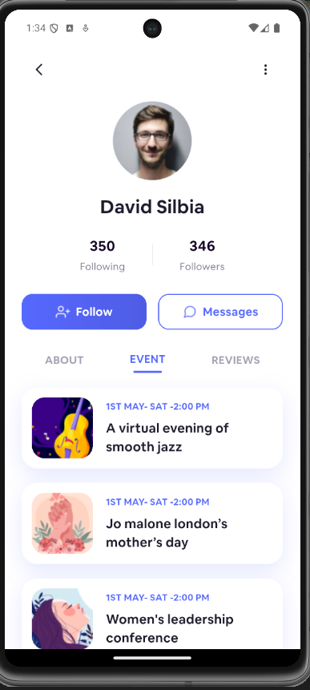 |

---

## Features

### Onboarding & Auth

- Animated splash screen
- 3-step onboarding carousel
- Sign In / Sign Up with form validation
- OTP Verification page
- Reset Password flow
- Social login buttons (Google, Facebook)

### Event Discovery

- Home screen with upcoming events feed
- **Search** with keyword input
- **Filter bottom sheet** — filter by:
  - Category (Sports, Music, Art, Food, Tech)
  - Time & Date (Today / Tomorrow / This week / Calendar picker)
  - Location
  - Price range slider
- Map view of nearby events
- See All Events listing
- Empty state screens

### Event Details

- Full event details page
- Buy Ticket button

### Profile

- My Profile screen (stats, about, interests)
- Organizer Profile (follow, message, tabs)
- Edit profile support

### Social

- Notifications feed + empty state
- Invite Friend screen
- Share event sheet

### Navigation

- Side drawer menu (white theme)
- Bottom navigation

---

## Tech Stack

| Layer            | Technology                                  |
| ---------------- | ------------------------------------------- |
| Framework        | Flutter 3.x                                 |
| Language         | Dart                                        |
| UI Design        | Figma → Flutter                             |
| Font             | AirbnbCereal (Light · Book · Medium · Bold) |
| Icons            | Material Icons                              |
| SVG support      | `flutter_svg ^2.2.3`                        |
| Splash animation | `animated_splash_screen ^1.3.0`             |
| Linting          | `flutter_lints ^6.0.0`                      |

---

## Project Structure

```
event_booking/
├── lib/
│   ├── core/
│   │   ├── constant/          # App fonts, images constants
│   │   ├── functions/         # Navigation helpers
│   │   ├── styles/            # AppColors, TextStyles, AppTheme
│   │   └── widgets/           # Reusable widgets (main_button, svg_picture, gradient_background)
│   └── features/
│       ├── auth/
│       │   ├── pages/         # SignIn, SignUp, Verification, ResetPassword
│       │   └── widgets/       # Form fields, social buttons, remember me row
│       ├── search/
│       │   ├── event_card/    # EventCardModel
│       │   ├── pages/         # SearchWhiteBar
│       │   └── widgets/       # FilterBottomSheet
│       ├── profile/           # ProfileScreen, OrganizerProfileScreen, EventsScreen
│       └── welcom/
│           └── pages/         # SplashScreen, Onboarding 1-3
├── assets/
│   ├── fonts/                 # AirbnbCereal font files
│   ├── icons/                 # SVG icons
│   └── images/                # Event images, illustrations
└── pubspec.yaml
```

---

## Getting Started

### Prerequisites

- Flutter SDK `^3.10.7`
- Dart SDK (bundled with Flutter)
- Android Studio / VS Code with Flutter extension

### Installation

```bash
# 1. Clone the repository
git clone https://github.com/NouranElshazly/Event-Booking-App-.git
cd Event-Booking-App-/event_booking

# 2. Install dependencies
flutter pub get

# 3. Run the app
flutter run
```

### Build

```bash
# Android APK
flutter build apk --release

# iOS (requires macOS + Xcode)
flutter build ios --release
```

> Designed in Figma · Built with Flutter
